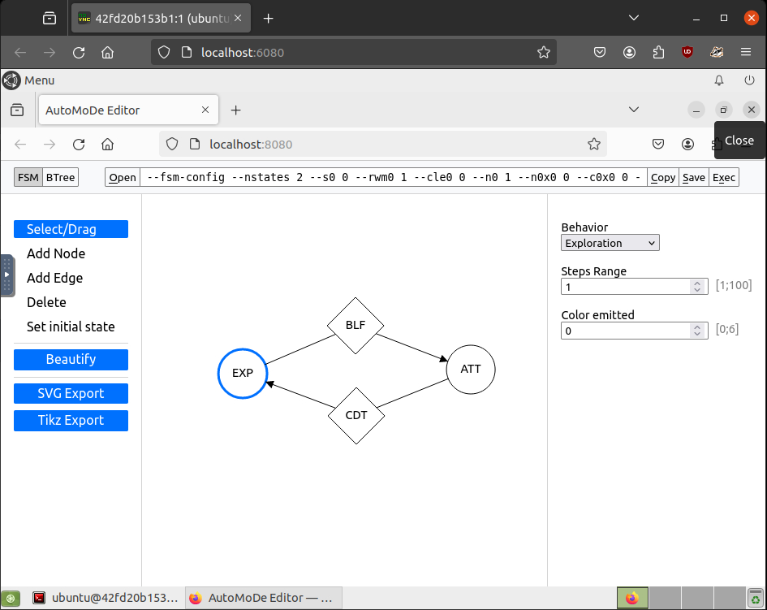
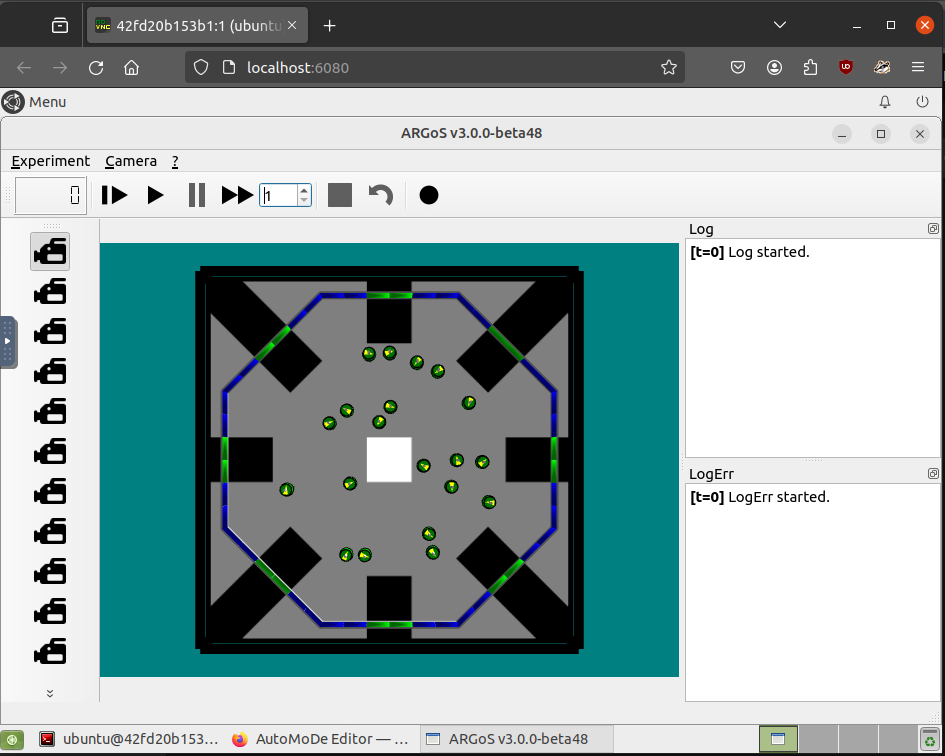
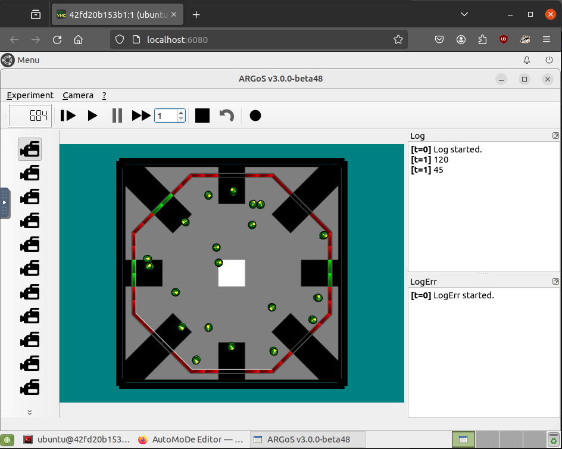

<!-- Link external JavaScript file -->
<script src="../questions.js"></script>

<style>
.algorithm {
  border-left: 4px solid #3b82f6; /* blue accent */
  background: #f0f7ff;            /* soft blue background */
  padding: 12px 16px;
  margin: 1em 0;
  border-radius: 6px;
  font-family: "JetBrains Mono", "Courier New", monospace;
  font-size: 14px;
  line-height: 1.5;
  white-space: pre-wrap;
}
.algorithm strong {
  display: block;
  font-weight: 600;
  margin-bottom: 6px;
}
.sq { display:inline-block; width:12px; height:12px; border:1px solid #000; vertical-align:middle; margin:0 2px; }
.sq.blue { background:#2563eb; }
.sq.red  { background:#dc2626; }
</style>


<style>
/* Lightweight styling for callouts and quizzes */
.definition, .assignment, .example, .slide{
  border-left: 4px solid #0ea5e9; padding: 0.75rem 1rem; margin: 1rem 0; background: #0ea5e90d;
}

.note {
  border-left: 4px solid #e9620eff; padding: 0.75rem 1rem; margin: 1rem 0; background: #e9990e0d;
}

.freading {
  border-left: 4px solid rgb(141, 141, 141); padding: 0.75rem 1rem; margin: 1rem 0; background: #ecececdd;
}

.slide { border-left-color:#22c55e; background:#22c55e0d; }
.assignment { border-left-color: #16a34a;background: #ecfdf5 }
.example { border-left-color:#a855f7; background:#a855f70d; }

.mcq { border:1px solid #e5e7eb; border-radius:8px; padding:1rem; margin:1rem 0; }
.mcq h4 { margin:0 0 0.5rem 0; }
.mcq .options { margin:0.5rem 0; }
.mcq label { display:block; cursor:pointer; margin:0.25rem 0; }
.mcq .actions { margin-top:0.5rem; }
.mcq button { border:0; padding:0.5rem 0.8rem; border-radius:6px; background:#111827; color:white; }
.mcq .result { margin-top:0.5rem; font-weight:600; }
.mcq.correct { border-color:#22c55e; background:#22c55e10; }
.mcq.incorrect { border-color:#ef4444; background:#ef444410; }
code.k { background:#f3f4f6; padding:0.1rem 0.3rem; border-radius:4px; }

/* === Heading hierarchy polish === */
/* h3 — main section dividers */
.main-content h3,
article h3,
.page-content h3 {
  font-size: 1.7rem;
  font-weight: 700;
  color: #0f172a;
  margin-top: 2.5rem;
  padding-bottom: 0.35rem;
  border-bottom: 2px solid #e5e7eb;
}

/* h4 — subsection titles; make clearly visible */
.main-content h4,
article h4,
.page-content h4 {
  font-size: 1.25rem;
  font-weight: 700;
  color: #0c4a6e;
  margin-top: 2rem;
  margin-bottom: 1rem;
  padding: 0.6rem 0.9rem;
  border-left: 5px solid #0ea5e9;
  background: linear-gradient(90deg, rgba(14,165,233,0.10) 0%, rgba(14,165,233,0.00) 80%);
  border-radius: 0 6px 6px 0;
  line-height: 1.35;
}

/* Keep the MCQ widget h4 compact (reset overrides above) */
.mcq h4 {
  font-size: 1rem;
  font-weight: 600;
  color: inherit;
  margin: 0 0 0.5rem 0;
  padding: 0;
  border: 0;
  background: none;
  border-radius: 0;
}

/* h5 — sub-sub-sections (sub-missions, install options) */
.main-content h5,
article h5,
.page-content h5 {
  font-size: 1.08rem;
  font-weight: 700;
  color: #1e293b;
  margin-top: 1.5rem;
  margin-bottom: 0.5rem;
  padding-left: 0.6rem;
  border-left: 3px solid #94a3b8;
}

/* Resources sub-blocks: ensure visible spacing between them */
.freading + .freading {
  margin-top: 1.25rem;
}

/* Make collapsible summaries feel clickable */
.freading details > summary {
  cursor: pointer;
  padding: 0.25rem 0;
  font-size: 1.05rem;
}
.freading details[open] > summary {
  margin-bottom: 0.5rem;
  border-bottom: 1px dashed #cbd5e1;
}

/* Slightly tighter horizontal rules */
hr {
  border: 0;
  border-top: 1px solid #e5e7eb;
  margin: 2rem 0;
}

/* Tables — modest visual polish */
.main-content table,
article table,
.page-content table {
  border-collapse: collapse;
  margin: 1rem 0;
  font-size: 0.95rem;
}
.main-content table th,
article table th,
.page-content table th {
  background: #f1f5f9;
  text-align: left;
  border-bottom: 2px solid #cbd5e1;
  padding: 0.5rem 0.75rem;
}
.main-content table td,
article table td,
.page-content table td {
  border-bottom: 1px solid #e5e7eb;
  padding: 0.45rem 0.75rem;
}
</style>

<a name="top"></a>
<a href="#top" id="back-to-top" title="Back to Top">🔝​</a>


# Swarm Robotics

<!-- bundle exec jekyll serve -->

- Table of Contents
{:toc}

## Prerequisites

To get the most out of this XXX module, it’s helpful to have:

---

## General Motivation

We are becoming increasingly familiar with robots that can perform tasks in a wide range of domains. Think, for example, of a lawn mower robot, an autonomous vacuum cleaner, or a flying drone for leisure photography. Today, these robots are mostly limited to operating as individual solutions. Soon, cooperation between robots will play a major role in transforming these solutions into large-scale robotics services. The problem is that programming robots to work together remains a challenging task that demands the expertise of skilled designers.

In this chapter, we explore how swarm robotics has emerged as a field to help address this problem. First, we introduce key concepts and provide a context to the field. Then, we discuss the challenges of designing robot swarms and approaches to help in designing the coordinated collective behavior of robot swarms. The chapter ends with practical sessions on the design of typical swarm robotics collective behaviours.

Swarm robotics is a rapidly developing field and the goal of the material presented here is not to be comprehensive. Rather, it is to provide robotics enthusiasts and practitioners with sufficient bases to explore the field on their own. Ideas on how to improve this chapter are welcomed—please refer to the contact section by the end.

## Course Content

### Getting started

In this section you will find materials and first instructions on how to prepare your computer to run the practical lessons of the robotics course. Three options are available to install the required software.

##### Docker users

An installation script is available to install the software in the Docker files provided in the Summer School. To install the software for this session, open a terminal while running the Docker container and enter the following command:

```bash
source /installation_scripts/day_5.sh
```

##### VirtualBox

A VirtualBox VM with the pre-installed software is provided in the shared Drive of the Summer School. You can download it from **Day 5 - Swarm Robotics**, and import it in your local installation of VirtualBox.

##### Native installation

Instructions for a native installation in Ubuntu 20.04 and Ubuntu 22.04 (experimental) are available in the session's repository:

```text
https://github.com/dagarzonr/sigsoft-swarms
```

---

### Introduction

The collective behavior of a robot swarm---and hence its ability to accomplish a particular mission---results from the interactions that the robots have with the environment and with their peers&nbsp;[\[1\]](#ref-1). Unfortunately, conceiving and implementing a collective behavior for a robot swarm is particularly challenging. The desired collective behavior for the robots is specified globally for the swarm, but the robots must be programmed individually. The challenge is that no generally applicable method exists to tell what an individual robot should do so that the desired collective behavior is obtained in the swarm&nbsp;[\[2\]](#ref-2).

In this practical session, the students will use a modular approach to design control software for a swarm of 20 *e-puck* robots that must perform a set of missions. The missions require the robots to communicate, navigate the environment, react to events, and display spatial-organization properties.

The exercise is based on *TuttiFrutti*&nbsp;[\[3\]](#ref-3), a modular design method specialized in the realization of collective behaviors for robots that can display and perceive color signals. *TuttiFrutti* generates control software in the form of probabilistic finite-state machines that combine parametric software modules. In *TuttiFrutti*, the design process is conducted by an optimization algorithm that searches the space of possible control software for good-performing instances. Conversely, in this practical session, the students will take on the role of optimization agents, combining and tuning *TuttiFrutti*'s software modules to create good-performing control software for the robots. The goal of this practical session is therefore to demonstrate how parametric software modules can be combined in different ways to obtain a variety of collective behaviors with a robot swarm.

To perform the exercise, students are provided with a visualization tool&nbsp;[\[4\]](#ref-4) (i)&nbsp;to produce and manipulate finite-state machines, (ii)&nbsp;to visualize simulations&nbsp;[\[5\]](#ref-5) of the resulting collective behavior, and (iii)&nbsp;to compute the performance of the swarm in each mission.

---

### Running the software

After installing the required software, open a new terminal (in the container, VM, or your PC). Enter the work directory and source the relevant environmental variables:

```bash
cd ~/sigsoft-swarms
source argos3-env.sh
```

Start an experiment by running the following script. Replace `ID` by the number of the mission you want to test, between 1 and 21---see [Experimental scenarios](#experimental-scenarios).

```bash
bash start_experiment.sh ID
```

Then, open the following URL in a browser,

```text
http://localhost:8088
```

This will spawn an interface that will allow you to create finite state-machines to program the robots and run simulations in ARGoS3---see the figure below.



The interface allows you to add, remove, and reorganize nodes and edges in your finite state-machine. By clicking in a software module (either a node or an edge) you will have access to the parameters that can be modified in each case. For example, you can select the type of node and its functional parameters. When you are satisfied with your design, click on the *Exec* button to spawn the ARGoS3 simulator and play the simulation to observe the behavior of the robots.

---

### Designing modular control software for robot swarms

You can design control software in the form of a probabilistic finite-state machine. In this architecture, states (nodes) represent low-level behaviors that the robots execute, and transition conditions (edges) represent events that trigger the change from one behavior to another. Each low-level behavior and transition condition is a parametric software module. You can design finite-state machines that have up to 4 states and up to 4 outgoing transitions from each state. The set of software modules that are available during the experiment is composed of 6 low-level behaviors (nodes) and 7 transition conditions (edges).

#### Low-level behaviors

The table below summarizes the set of *TuttiFrutti*'s low-level behaviors.

| Low-level behavior * | Parameters | Description |
|---|---|---|
| `Exploration` | $\{\tau,\gamma\}$ | movement by random walk |
| `Stop` | $\{\gamma\}$ | standstill state |
| `Attraction` | $\{\alpha,\gamma\}$ | physics-based attraction to neighboring robots |
| `Repulsion` | $\{\alpha,\gamma\}$ | physics-based repulsion from neighboring robots |
| `Follow` | $\{\delta,\gamma\}$ | steady movement towards robots/objects of color $\delta$ |
| `Elude` | $\{\delta,\gamma\}$ | steady movement away from robots/objects of color $\delta$ |

<p style="font-size:0.9em; color:#475569;">* All low-level behaviors display a color $\gamma\in\{\varnothing,C,M,Y\}$ alongside the action described.</p>

<div class="note" markdown="1">
**Parameters:**

- The parameter `Steps range` ($\tau\in\{1, 100\}$) determines the maximum number of time steps that a robot rotates when it faces an obstacle.
- The parameter `Attraction` ($\alpha\in\{1, 5\}$) is the attraction factor to neighboring robots.
- The parameter `Repulsion` ($\alpha\in\{1, 5\}$) is the repulsion factor from neighboring robots.
- The parameter `Color perceived` ($\delta\in\{1, 6\}$) determines the color to which a robot reacts in a given state:
  - 1 → Red
  - 2 → Green
  - 3 → Blue
  - 4 → Yellow
  - 5 → Magenta
  - 6 → Cyan
- All low-level behaviors enable the robot for displaying a color with its LEDs. The parameter `Color emitted` ($\gamma\in\{0,6\}$) determines the color that the robot displays:
  - 0 → No color
  - 1 → Red
  - 2 → Green
  - 3 → Blue
  - 4 → Yellow
  - 5 → Magenta
  - 6 → Cyan
</div>

#### Transition conditions

The table below summarizes the set of *TuttiFrutti*'s transition conditions.

| Transition condition | Parameters | Description |
|---|---|---|
| `Black-floor` | $\{\beta\}$ | black floor beneath the robot |
| `Gray-floor` | $\{\beta\}$ | gray floor beneath the robot |
| `White-floor` | $\{\beta\}$ | white floor beneath the robot |
| `Many-neighbors` | $\{\xi,\eta\}$ | number of neighboring robots greater than $\xi$ |
| `Few-neighbors` | $\{\xi,\eta\}$ | number of neighboring robots less than $\xi$ |
| `Fixed-probability` | $\{\beta\}$ | transition with a fixed probability |
| `Color-perceived` | $\{\delta,\beta\}$ | robots/objects of color $\delta$ perceived |

<div class="note" markdown="1">
**Parameters:**

- In all transitions, the parameter `Probability` ($\beta\in[0, 1]$) determines the probability of executing a transition when the given condition is fulfilled.
- The parameter $\eta\in\{1, 10\}$ determines the sensitivity at which the transition triggers when the robot is in the presence of $\xi\in\{0, 20\}$ neighboring robots.
- The parameter `Color perceived` ($\delta\in\{1, 6\}$) determines the color that triggers the transition:
  - 1 → Red
  - 2 → Green
  - 3 → Blue
  - 4 → Yellow
  - 5 → Magenta
  - 6 → Cyan
</div>

---

### Experimental scenarios

You will experiment with a swarm of twenty *e-puck* robots that must perform single-criterion missions, or multi-criteria missions composed of two sequential parts&nbsp;[\[6\]](#ref-6). We create missions by combining a set of 6 sub-missions. For each sub-mission, the performance of the swarm is evaluated by an independent objective function: the design criteria.

The robots operate in an octagonal arena of $2.75\,\text{m}^{2}$ surrounded by RGB blocks---see the figure below. The robots are randomly positioned at the beginning of each experimental run. The RGB blocks are arranged in walls and each of them can possibly display a different color. The floor of the arena is gray with nine square patches, each measuring 25 cm on each side. One of the patches is white, and the other eight are black. In every mission, RGB blocks adjacent to black patches initially turn green, and afterward, they will randomly switch off with uniform probability. The remaining RGB blocks turn red or blue to inform the robots about the sub-mission to be executed.




*The experimental arena. The pictures show examples of the two possible states of the arena. At the top, the RGB blocks of the walls display blue and all RGB blocks adjacent to a black patch are switched on, displaying green. At the bottom, the RGB blocks of the walls display red and some RGB blocks adjacent to a black patch have switched off, displaying no color. The robots are randomly positioned.*

#### Sub-missions

We consider a set of six sub-missions ($\text{S}${$\{1,\cdots,6\}$}). Each sub-mission is specified by a description of a task to be executed and a corresponding objective function.

##### Sub-mission 1 ($\mathbf{S1}$)

The robots must occupy the black patches whose adjacent RGB blocks display green. The swarm is given 1 point for every 100 cumulative timesteps that the robots spend on each suitable patch. For example, a single robot in a patch will be given one point after 100 timesteps, but 10 robots in a patch will be given 1 point after 10 timesteps.

The score of the swarm is the number of points it obtains in the allotted time:

$$f_{\text{S}1}=\sum_{t=1}^{T^{\prime}}\sum_{i=1}^{H}I_{i}(t),$$

which must be maximized. $H$ is the number of patches and $T^{\prime}$ the time available to the robots to perform the sub-mission. The indicator $I_{i}(t)$ is defined as:

$$I_{i}(t)=\begin{cases} 1, & \text{if at time $t$ the robots accumulate 100 timesteps in the patch $i$;} \\\\0, & \text{otherwise}.\end{cases}$$

Sub-mission $\text{S}1$ is inspired by aggregation missions in which the robots must gather at an indicated place&nbsp;[\[7\]](#ref-7),[\[8\]](#ref-8).

##### Sub-mission 2 ($\mathbf{S2}$)

The robots must iteratively travel from any black patch to the white one. The swarm is given 1 point every time a robot completes a trip.

The score of the swarm is the number of points it obtains in the allotted time:

$$f_{\text{S}2}=I_{T^{\prime}},$$

which must be maximized. $I_{T^{\prime}}$ is the number of trips executed in the time $T^{\prime}$ available to the robots to perform the sub-mission.

Sub-mission $\text{S}2$ is inspired by foraging missions in which the robots must travel between two locations: a food source and a nest&nbsp;[\[3\]](#ref-3),[\[7\]](#ref-7).

##### Sub-mission 3 ($\mathbf{S3}$)

The robots must occupy the black patches adjacent to RGB blocks that are switched off. The swarm is given one point if at least two robots spend 50 timesteps in the corresponding black patch. The count of timesteps starts as soon as the two robots step into the patch, and it will continue as long as they both remain on it. The count is not affected if more than two robots occupy the patch.

The score of the swarm is the number of points it obtains in the allotted time:

$$f_{\text{S}3}=\sum_{t=1}^{T^{\prime}}\sum_{i=1}^{H}I_{i}(t),$$

which must be maximized. $H$ represents the number of patches and $T^{\prime}$ the time available to the robots to perform the sub-mission. The indicator $I_{i}(t)$ is defined as:

$$I_{i}(t)=\begin{cases} 1, & \text{if at time $t$ two robots accumulate 50 timesteps in the patch $i$;} \\\\0, & \text{otherwise}.\end{cases}$$


Sub-mission $\text{S}3$ is inspired by strictly cooperative missions in which the robots must jointly perform a single task&nbsp;[\[9\]](#ref-9),[\[10\]](#ref-10).

##### Sub-mission 4 ($\mathbf{S4}$)

The robots must iteratively enter and leave the white patch. The swarm is awarded 1 point every time a robot performs these two actions.

The score of the swarm is the number of points it obtains in the allotted time:

$$f_{\text{S}4}=I_{T^{\prime}},$$

which must be maximized. $I_{T^{\prime}}$ is the number of times a robot entered and left the white patch in the time $T^{\prime}$ that is available to the robots to perform the sub-mission.

Also sub-mission $\text{S}4$ is inspired by foraging missions, as sub-mission $\text{S}2$, but here, the robots start and end at a single location.

##### Sub-mission 5 ($\mathbf{S5}$)

The robots must disperse and cover the arena. We consider the coverage to be the most effective when the minimum distance between any two pair of robots is maximized.

The score of the swarm is the cumulative sum of the minimum inter-robot distance, over time:

$$f_{\text{S}5}=\sum_{t=1}^{T^{\prime}}\min\big(d_{ij}(t)\big),$$

which must be maximized. Here, $d_{ij}$ is the minimum distance between any pair of robots ($i,j$) at time $t$, and $T^{\prime}$ is the time available to the robots to perform the sub-mission.

Sub-mission $\text{S}5$ is inspired by dispersion and coverage missions in which the robots must maintain a fixed inter-robot distance to achieve a specific spatial distribution&nbsp;[\[8\]](#ref-8),[\[11\]](#ref-11).

##### Sub-mission 6 ($\mathbf{S6}$)

The robots must remain within a 25 cm distance from the walls of the arena, without entering the black patches.

The score of the swarm is the aggregate time that the robots spend in the suitable areas:

$$f_{\text{S}6}=\sum_{t=1}^{T^{\prime}}\sum_{i=1}^{N}I_{i}(t),$$

which must be maximized. $N$ is the number of robots and $T^{\prime}$ is the time available to the robots to perform the sub-mission. The indicator $I_{i}(t)$ is defined as:


$$I_{i}(t)=\begin{cases} 1, & \text{if the robot $i$ is in gray floor and in a 25 cm distance from a wall at time $t$;} \\\\0, & \text{otherwise}.\end{cases}$$

Sub-mission $\text{S}6$ is inspired by missions in which the robots must display a specific spatial distribution, like sub-mission $\text{S}5$&nbsp;[\[8\]](#ref-8),[\[11\]](#ref-11). However, the robots here must maintain a specific distance from an element in their environment, irrespective of the distance to their peers.

#### Single-criteria missions

We define the set $\text{M}&#95;{s}$ of single-criteria missions ($m&#95;{\text{S}p.\text{S}p}$) by evaluating a single sub-mission in both parts of the mission, where $p=q$. This results in 6 missions---see the table below.

The time $T$ available to the robots to execute a mission is 120 s. Accordingly, the swarm's performance in a mission is assessed for the whole time regarding a single performance metric. A single score is returned after each experimental run. We expect the swarm to be able to perform a mission $m_{\text{S}p.\text{S}q}$ regardless of the order of $\text{S}p$ and $\text{S}q$.

| ID | Mission | Sub-mission $\text{S}p$ |  | Sub-mission $\text{S}q$ |
|:--:|:--:|:--:|:--:|:--:|
| 1 | $m_{\text{S}1.\text{S}1}$ | $\text{S}1$ | <span class="sq blue"></span> $\rightleftarrows$ <span class="sq red"></span> | $\text{S}1$ |
| 2 | $m_{\text{S}2.\text{S}2}$ | $\text{S}2$ | <span class="sq blue"></span> $\rightleftarrows$ <span class="sq red"></span> | $\text{S}2$ |
| 3 | $m_{\text{S}3.\text{S}3}$ | $\text{S}3$ | <span class="sq blue"></span> $\rightleftarrows$ <span class="sq red"></span> | $\text{S}3$ |
| 4 | $m_{\text{S}4.\text{S}4}$ | $\text{S}4$ | <span class="sq blue"></span> $\rightleftarrows$ <span class="sq red"></span> | $\text{S}4$ |
| 5 | $m_{\text{S}5.\text{S}5}$ | $\text{S}5$ | <span class="sq blue"></span> $\rightleftarrows$ <span class="sq red"></span> | $\text{S}5$ |
| 6 | $m_{\text{S}6.\text{S}6}$ | $\text{S}6$ | <span class="sq blue"></span> $\rightleftarrows$ <span class="sq red"></span> | $\text{S}6$ |

<p style="font-size:0.9em; color:#475569;"><em>Set of single-criteria missions ($\text{M}_s$). The missions are execution of each of the six sub-missions ($\text{S}_{\{1,\cdots,6\}}$). The colors blue and red characterize the sub-missions $\text{S}p$ (<span class="sq blue"></span>) and $\text{S}q$ (<span class="sq red"></span>). In a mission ($m_{\text{S}p.\text{S}q}$), the sub-missions $\text{S}p$ and $\text{S}q$ represent the same sub-mission ($p=q$), but the order of the sequence and colors ($\text{S}p$ <span class="sq blue"></span> $\rightleftarrows$ <span class="sq red"></span> $\text{S}q$) is randomly defined in every experimental run. $\text{S}p$ and $\text{S}q$ are executed during an equivalent period of time. The execution of a mission $m_{\text{S}p.\text{S}q}$ returns a single score for the swarm with respect to the corresponding sub-mission, regardless of the order of the sequence.</em></p>

#### Multi-criteria missions

We define the set $\text{M}$ of multi-criteria missions ($m_{\text{S}p.\text{S}q}$) by pairing sub-missions ($\text{S}p$, $\text{S}q$) in fifteen combinations---see the table below. Unlike the single-criteria missions, in this case $p\neq q$.

In all cases, the robots must execute the two sub-missions, one after the other. The time $T$ available to the robots to execute a mission is 120 s. The time $T^{\prime}$ available to execute each sub-mission is 60 s. Accordingly, the swarm's performance in a mission is assessed for the initial 60 s with regard to one sub-mission and for the remaining 60 s with regard to the other. The two scores are returned after each experimental run. We expect the swarm to be able to perform a mission $m_{\text{S}p.\text{S}q}$ regardless of the order of $\text{S}p$ and $\text{S}q$.

| ID | Mission | Sub-mission $\text{S}p$ |   | Sub-mission $\text{S}q$ |
|:--:|:--:|:--:|:--:|:--:|
| 7  | $m_{\text{S}1.\text{S}2}$ | $\text{S}1$ | <span class="sq blue"></span> $\rightleftarrows$ <span class="sq red"></span> | $\text{S}2$ |
| 8  | $m_{\text{S}1.\text{S}3}$ | $\text{S}1$ | <span class="sq blue"></span> $\rightleftarrows$ <span class="sq red"></span> | $\text{S}3$ |
| 9  | $m_{\text{S}1.\text{S}4}$ | $\text{S}1$ | <span class="sq blue"></span> $\rightleftarrows$ <span class="sq red"></span> | $\text{S}4$ |
| 10 | $m_{\text{S}1.\text{S}5}$ | $\text{S}1$ | <span class="sq blue"></span> $\rightleftarrows$ <span class="sq red"></span> | $\text{S}5$ |
| 11 | $m_{\text{S}1.\text{S}6}$ | $\text{S}1$ | <span class="sq blue"></span> $\rightleftarrows$ <span class="sq red"></span> | $\text{S}6$ |
| 12 | $m_{\text{S}2.\text{S}3}$ | $\text{S}2$ | <span class="sq blue"></span> $\rightleftarrows$ <span class="sq red"></span> | $\text{S}3$ |
| 13 | $m_{\text{S}2.\text{S}4}$ | $\text{S}2$ | <span class="sq blue"></span> $\rightleftarrows$ <span class="sq red"></span> | $\text{S}4$ |
| 14 | $m_{\text{S}2.\text{S}5}$ | $\text{S}2$ | <span class="sq blue"></span> $\rightleftarrows$ <span class="sq red"></span> | $\text{S}5$ |
| 15 | $m_{\text{S}2.\text{S}6}$ | $\text{S}2$ | <span class="sq blue"></span> $\rightleftarrows$ <span class="sq red"></span> | $\text{S}6$ |
| 16 | $m_{\text{S}3.\text{S}4}$ | $\text{S}3$ | <span class="sq blue"></span> $\rightleftarrows$ <span class="sq red"></span> | $\text{S}4$ |
| 17 | $m_{\text{S}3.\text{S}5}$ | $\text{S}3$ | <span class="sq blue"></span> $\rightleftarrows$ <span class="sq red"></span> | $\text{S}5$ |
| 18 | $m_{\text{S}3.\text{S}6}$ | $\text{S}3$ | <span class="sq blue"></span> $\rightleftarrows$ <span class="sq red"></span> | $\text{S}6$ |
| 19 | $m_{\text{S}4.\text{S}5}$ | $\text{S}4$ | <span class="sq blue"></span> $\rightleftarrows$ <span class="sq red"></span> | $\text{S}5$ |
| 20 | $m_{\text{S}4.\text{S}6}$ | $\text{S}4$ | <span class="sq blue"></span> $\rightleftarrows$ <span class="sq red"></span> | $\text{S}6$ |
| 21 | $m_{\text{S}5.\text{S}6}$ | $\text{S}5$ | <span class="sq blue"></span> $\rightleftarrows$ <span class="sq red"></span> | $\text{S}6$ |

<p style="font-size:0.9em; color:#475569;"><em>Set of multi-criteria missions ($\text{M}$). The missions are paired combinations ($m_{\text{S}p.\text{S}q}$) of the six sub-missions ($\text{S}_{\{1,\cdots,6\}}$). In each combination, the colors blue and red characterize the sub-missions $\text{S}p$ (<span class="sq blue"></span>) and $\text{S}q$ (<span class="sq red"></span>). In a mission ($m_{\text{S}p.\text{S}q}$), the sub-missions $\text{S}p$ and $\text{S}q$ must be executed in sequence, but the order of the sequence ($\text{S}p$ <span class="sq blue"></span> $\rightleftarrows$ <span class="sq red"></span> $\text{S}q$) is randomly defined in every experimental run. $\text{S}p$ and $\text{S}q$ are executed during an equivalent period of time. The execution of a mission $m_{\text{S}p.\text{S}q}$ returns the score of the swarm with respect to $\text{S}p$ and $\text{S}q$, regardless of the order of the sequence.</em></p>

---

### To be considered

<div class="assignment" markdown="1">
While conducting the experiments, consider the following questions and reflect on how they influence the design process you use to achieve a satisfactory solution for a mission.

- How do you know whether the swarm is already operating in a satisfactory manner? How do you know if the swarm has a sufficiently good performance?
- Does the performance of the swarm vary from one run to the other? If so, what can cause such variance?
- Can you think of a strategy to decide the effort you devote to address each mission?
- What factors influence your design process in the multi-criteria mission? Are there reasons to favour one criteria over the other?
</div>

---

<!-- ### Contact information

If you require further information, do not hesitate to contact us.

```text
David Garzón Ramos
david.garzonramos@bristol.ac.uk
Research Associate - University of Bristol
``` -->

<div class="freading">
<details>
<summary><strong>References</strong></summary>
<div markdown="1">

<p><a id="ref-1"></a>[1] <b>M. Dorigo, M. Birattari, and M. Brambilla</b>, "Swarm robotics," <i>Scholarpedia</i>, vol. 9, no. 1, p. 1463, 2014. [<a href="http://www.scholarpedia.org/article/Swarm_robotics">Link</a>]</p>

<p><a id="ref-2"></a>[2] <b>M. Brambilla, E. Ferrante, M. Birattari, and M. Dorigo</b>, "Swarm robotics: a review from the swarm engineering perspective," <i>Swarm Intelligence</i>, vol. 7, no. 1, pp. 1–41, 2013. [<a href="https://doi.org/10.1007/s11721-012-0075-2">DOI</a>]</p>

<p><a id="ref-3"></a>[3] <b>D. Garzón Ramos and M. Birattari</b>, "Automatic design of collective behaviors for robots that can display and perceive colors," <i>Applied Sciences</i>, vol. 10, no. 13, p. 4654, 2020. [<a href="https://doi.org/10.3390/app10134654">DOI</a>]</p>

<p><a id="ref-4"></a>[4] <b>J. Kuckling, K. Hasselmann, V. van Pelt, C. Kiere, and M. Birattari</b>, "AutoMoDe Editor: a visualization tool for AutoMoDe," IRIDIA, Université libre de Bruxelles, Tech. Rep. TR/IRIDIA/2021-009, 2021. [<a href="https://demiurge.be/publications/pdf_author_versions/KucHasVan-etal2021techrep.pdf">Link</a>]</p>

<p><a id="ref-5"></a>[5] <b>C. Pinciroli et al.</b>, "ARGoS: a modular, parallel, multi-engine simulator for multi-robot systems," <i>Swarm Intelligence</i>, vol. 6, no. 4, pp. 271–295, 2012. [<a href="https://doi.org/10.1007/s11721-012-0072-5">DOI</a>]</p>

<p><a id="ref-6"></a>[6] <b>D. Garzón Ramos, F. Pagnozzi, T. Stützle, and M. Birattari</b>, "Automatic design of robot swarms under concurrent design criteria: a study based on Iterated F-Race," <i>Advanced Intelligent Systems</i>, vol. 7, no. 1, p. 2400332, 2024. [<a href="https://doi.org/10.1002/aisy.202400332">DOI</a>]</p>

<p><a id="ref-7"></a>[7] <b>G. Francesca, M. Brambilla, A. Brutschy, V. Trianni, and M. Birattari</b>, "AutoMoDe: a novel approach to the automatic design of control software for robot swarms," <i>Swarm Intelligence</i>, vol. 8, no. 2, pp. 89–112, 2014. [<a href="https://doi.org/10.1007/s11721-014-0092-4">DOI</a>]</p>

<p><a id="ref-8"></a>[8] <b>G. Francesca et al.</b>, "AutoMoDe-Chocolate: automatic design of control software for robot swarms," <i>Swarm Intelligence</i>, vol. 9, no. 2-3, pp. 125–152, 2015. [<a href="https://doi.org/10.1007/s11721-015-0107-9">DOI</a>]</p>

<p><a id="ref-9"></a>[9] <b>A. J. Ijspeert, A. Martinoli, A. Billard, and L. M. Gambardella</b>, "Collaboration through the exploitation of local interactions in autonomous collective robotics: the stick pulling experiment," <i>Autonomous Robots</i>, vol. 11, no. 2, pp. 149–171, 2001. [<a href="https://doi.org/10.1023/A:1011227210047">DOI</a>]</p>

<p><a id="ref-10"></a>[10] <b>V. Trianni and M. López-Ibáñez</b>, "Advantages of task-specific multi-objective optimisation in evolutionary robotics," <i>PLOS ONE</i>, vol. 10, no. 8, p. e0136406, 2015. [<a href="https://doi.org/10.1371/journal.pone.0136406">DOI</a>]</p>

<p><a id="ref-11"></a>[11] <b>F. J. Mendiburu, D. Garzón Ramos, M. R. A. Morais, A. M. N. Lima, and M. Birattari</b>, "AutoMoDe-Mate: automatic off-line design of spatially-organizing behaviors for robot swarms," <i>Swarm and Evolutionary Computation</i>, vol. 74, p. 101118, 2022. [<a href="https://doi.org/10.1016/j.swevo.2022.101118">DOI</a>]</p>

</div>
</details>
</div>

---

## Credits

## Ressources


---

[Back to Top](#start)