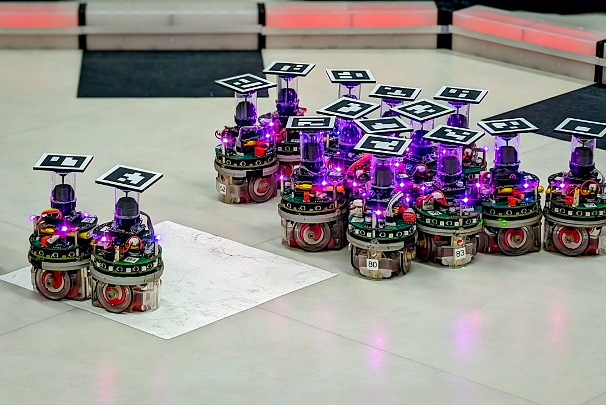
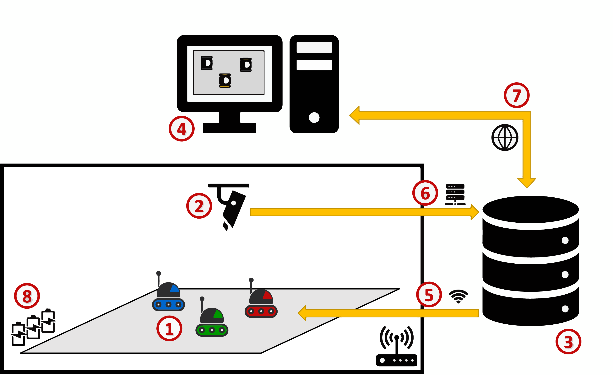

<!-- Link external JavaScript file -->
<script src="../questions.js"></script>

<style>
.algorithm {
  border-left: 4px solid #3b82f6; /* blue accent */
  background: #f0f7ff;            /* soft blue background */
  padding: 12px 16px;
  margin: 1em 0;
  border-radius: 6px;
  font-family: "JetBrains Mono", "Courier New", monospace;
  font-size: 14px;
  line-height: 1.5;
  white-space: pre-wrap;
}
.algorithm strong {
  display: block;
  font-weight: 600;
  margin-bottom: 6px;
}
</style>


<style>
/* Lightweight styling for callouts and quizzes */
.definition, .assignment, .example, .slide{
  border-left: 4px solid #0ea5e9; padding: 0.75rem 1rem; margin: 1rem 0; background: #0ea5e90d;
}

.note {
  border-left: 4px solid #e9620eff; padding: 0.75rem 1rem; margin: 1rem 0; background: #e9990e0d;
}

.freading {
  border-left: 4px solid rgb(141, 141, 141); padding: 0.75rem 1rem; margin: 1rem 0; background: #ecececdd;
}

.slide { border-left-color:#22c55e; background:#22c55e0d; }
.assignment { border-left-color: #16a34a;background: #ecfdf5 }
.example { border-left-color:#a855f7; background:#a855f70d; }

.mcq { border:1px solid #e5e7eb; border-radius:8px; padding:1rem; margin:1rem 0; }
.mcq h4 { margin:0 0 0.5rem 0; }
.mcq .options { margin:0.5rem 0; }
.mcq label { display:block; cursor:pointer; margin:0.25rem 0; }
.mcq .actions { margin-top:0.5rem; }
.mcq button { border:0; padding:0.5rem 0.8rem; border-radius:6px; background:#111827; color:white; }
.mcq .result { margin-top:0.5rem; font-weight:600; }
.mcq.correct { border-color:#22c55e; background:#22c55e10; }
.mcq.incorrect { border-color:#ef4444; background:#ef444410; }
code.k { background:#f3f4f6; padding:0.1rem 0.3rem; border-radius:4px; }
</style>

<a name="top"></a>
<a href="#top" id="back-to-top" title="Back to Top">🔝​</a>


# Swarm Robotics

<!-- bundle exec jekyll serve -->

- Table of Contents
{:toc}

## Prerequisites

To get the most out of this Swarm Robotics module, it’s helpful to have prior knowdlege on basic mobile robotic systems and multi-agent systems. However, these are not mandatory and the content can be followed at a beginners level.

---

## General Motivation

We are becoming increasingly familiar with robots that can perform tasks in a wide range of domains. Think, for example, of a lawn mower robot, an autonomous vacuum cleaner, or a flying drone for leisure photography. Today, these robots are mostly limited to operating as individual solutions. Soon, cooperation between robots will play a major role in transforming these solutions into large-scale robotics services. The problem is that programming robots to work together remains a challenging task that demands the expertise of skilled designers.

In this chapter, we explore how swarm robotics has emerged as a field to help address this problem. First, we introduce key concepts and provide a context to the field. Then, we discuss the challenges of designing robot swarms and approaches to help in producing their control software. The chapter ends with practical sessions on the design of typical swarm robotics collective behaviours.

Swarm robotics is a rapidly developing field and the goal of the material presented here is not to be comprehensive. Rather, it is to provide robotics enthusiasts and practitioners with sufficient bases to explore the field on their own. This includes providing references to research that can inspire new work.

Ideas on how to improve this chapter are welcomed—please refer to the contact section by the end.

---

## Course Content

---

### Introduction

In a nutshell, a robot swarm is a self-organized group of robots that, by working together, can collectively perform missions beyond the capabilities of individual robots. 


*Figure 1. Swarm of [e-puck](https://infoscience.epfl.ch/record/135236) robots.*

A particularity of robot swarms is that the robots operate autonomously without relying on a leader robot or on external infrastructure. The collective behavior of a robot swarm—and hence the swarm’s ability to accomplish a particular mission—results solely from the interactions that the robots have with the environment and with their peers.

The problem is that, as of today, conceiving and implementing a collective behavior for a robot swarm is challenging. The desired collective behavior for the robots is specified globally for the swarm, but this behavior cannot be programmed directly. At design time, one must produce control software to program the individual actions of the robots. At deployment time, the collective behavior of the swarm will emerge from the interactions between robots, and robots and their environment. The challenge is that no generally applicable method exists to tell what an individual robot should do so that the desired collective behavior is obtained in the swarm.

Swarm robotics emerged therefore as the study of how to design robot swarms. The field's seminal work is often dated to 2005, with work by [Şahin](https://doi.org/10.1007/978-3-540-30552-1_2) and [Beni](https://doi.org/10.1007/978-3-540-30552-1_1). Since then, swarm robotics has attracted attention in the scientific community, with numerous papers published in high visibility venues such as *Nature*, *Science*, *Science Robotics*, and similar ones.

Moreover, the design of robot swarms has been identified as one of the [major robotics challenges](https://doi.org/10.1126/scirobotics.aar7650) to be addressed in the upcoming years. [Recent discussions](https://doi.org/10.1126/scirobotics.abe4385) have foreseen the enablers that would drive the advance of swarm robotics:

1. the appearance of novel robot platforms that can operate in unstructured and dynamic environments;
2. the development of new methodologies for the design of collective behaviors ;
3. new opportunities to exploit emergence;
4. the shift of focus towards applications suited for large groups of coordinated robots—e.g., precision agriculture, ecological monitoring, and city cleaning.

Although the future is promising, it is worth noting that, at present, most achievements in swarm robotics research still occur under controlled laboratory conditions.

<div class="freading">
  <details markdown="1">
  <summary><strong>Read further</strong></summary> 
  Examples of swarm robotics enablers:
  1. **Novel platforms**: [Berlinger et al.](https://doi.org/10.1126/scirobotics.abd8668) introduces Blueswarm, a fish-inspired underwater robot swarm capable of 3D collective behaviors in an unstructured aquatic environment, demonstrating that swarms can operate beyond the controlled laboratory settings typical of the field.
  2. **New methodologies**: [Mathews et al.](https://doi.org/10.1038/s41467-017-00109-2) presents mergeable nervous systems, a design methodology where robots can physically connect and share a unified distributed control architecture, enabling the swarm to dynamically reconfigure itself as a single larger robot.
  3. **Exploiting emergence**: [Garattoni & Birattari](https://doi.org/10.1126/scirobotics.aat0430) show that a swarm of simple robots can autonomously sequence and plan the execution of a multi-step task, a planning capability that emerges entirely from local interactions without any centralized control or explicit planning module.
  4. **Focusing on application challenges**: [Hunt & Hauert](https://doi.org/10.1038/s42256-020-0213-2) proposes a safety checklist for robot swarms, directly addressing the non-technical barriers to real-world deployment by providing a framework to assess and communicate safety.

  Examples of exciting research in swarm robotics:
  - [Programmable self-assembly in a thousand-robot swarm](https://doi.org/10.1126/science.1254295).
  - [Designing collective behavior in a termite-inspired robot construction team](https://doi.org/10.1126/science.1245842).
  - [From collections of independent, mindless robots to flexible, mobile, and directional superstructures
](https://doi.org/10.1126/scirobotics.abd0272).
  - [Morphogenesis in robot swarms](https://doi.org/10.1126/scirobotics.aau9178).
  - [Ultra-extensible ribbon-like magnetic microswarm](https://doi.org/10.1038/s41467-018-05749-6).
  - [Particle robotics based on statistical mechanics of loosely coupled components](https://doi.org/10.1038/s41586-019-1022-9).
  - [Reconfigurable magnetic microrobot swarm: multimode transformation, locomotion, and manipulation](https://doi.org/10.1126/scirobotics.aav8006).
  - [When less is more: robot swarms adapt better to changes with constrained communication](https://doi.org/10.1126/scirobotics.abf1416).
  - [Secure and secret cooperation in robot swarms](https://doi.org/10.1126/scirobotics.abf1538).
  - [Automatic design of stigmergy-based behaviours for robot swarms](https://doi.org/10.1038/s44172-024-00175-7).
  - [Self-organizing nervous systems for robot swarms](https://doi.org/10.1126/scirobotics.adl5161).
  </details>
</div>

### How to get started into swarm robotics?

Swarm robotics is an appealing field to get started with robotics. It requires minimal infrastructure and it can be studied with relatively simple robots. Below a typical configuration of swarm robotics testbet.


*Figure 2. Typical infrastructure involved in swarm robotics experimentation, by [Kegeleirs et al](https://doi.org/10.1016/j.ohx.2026.e00751). The figure illustrates (1)~robots, (2)~tracking system, (3)~experiments server, (4)~workstation, (5)~wireless router, (6)~experiment information streamed to the server, (7)~access to experiments server, and (8)~charging docks for the robots.*

<div class="freading">
  <details markdown="1">
  <summary><strong>Read further</strong></summary> 
  - A robot swarm is deployed in an experimental environment **(1)**, which may include obstacles, mission-related objects, or other robots.
  - A wireless router provides network connectivity **(5)**, allowing control software to be deployed to the robots and enabling them to receive experiment instructions—typically to initialize or start a run—from an experiment server **(3)**. This server acts as the main interface for operating and monitoring the experimental infrastructure.
  - The environment is monitored by an external tracking system **(2)** that estimates the state of each robot throughout the experiment (e.g., positions, velocities, or other relevant information).
  - The information is streamed **(6)** to the server for logging, visualization, and post-experimental analysis. The tracking system does not communicate directly with the robots and does not influence their behavior during execution.
  - Researchers interact with the system through a workstation **(4)**, which provides access to the server, tracking data, and experiment control tools, either locally or through the web **(7)**.
  - Finally, sufficient batteries and/or charging docks should be available **(8)** to support rapid turnaround between experimental runs.
  </details>
</div>

---

**Are you just getting started and see yourself as a beginner?** Start simple: build robots and program them to react to each other.

Swarm robotics develops on the idea that relatively simple robots can demostrate intelligent collective behaviour. Therefore, a path to introduce yourself into swarm robotics is building a group of relatively simple robots and programming them to move together in an enclosed space.

Setting aside simulation environments (covered in the practical sessions), building small simple robots is a cost-effective way to explore the field. The goal is to build a group of robots that are capable of rumbling around and intereact with each other, even if done by physical contact.

Building robots for swarm robotics is generally an activity suited to high-school, graduate and posgraduate education, as well as for research purposes.

<div class="freading">
  <details markdown="1">
  <summary><strong>Read further</strong></summary> 
  Examples of simple platforms built for conducting swarm robotics research:
  1. Educational robots turned into a swarm: the [Thymio](https://doi.org/10.1177/172988141882518) and the [Mercator](https://doi.org/10.1016/j.ohx.2026.e00751).
  2. Fabricating and experimenting with simplified robot morphologies: the [Kilobot](https://doi.org/10.1126/science.1254295) and the [Bristlebots](https://doi.org/10.1126/scirobotics.abd0272).
  </details>
</div>

---

**Are you already robotics-savvy and consider yourself an enthusiast?** Try to bring out collective behavior in the robots you are already familiar with.

If experienced with robotics and with more mathematical background, a more challenging path to swarm robotics is implement behavioural models into simple robotic systems. The swarm robotics literature is build around certain typical platforms, but you can try them on the robots you use (whether drones, quadrupeds, humanoids, or small educational robots).

Designing collective behaviors for robot swarms typically implies finding simple equation models that describe the collective behaviour in natural systems and turning them into algorithmic implementatios deployed as controllers for the robots (e.g., cockroaches aggregating in a given place, or molecular arrangments)

This is a fascinating way of understanding collective behaviour. The swarm is not programmed directly, the individual robots are. Given a certain set of rules (described by the model), a robot maps its sensor inputs into actions. The interaction of robots executing this rules is what eventually materializes into a collective behavior. 

The challenge is therefore to find models (or algorithmic solutions), that when deployed on the individual robots, allow to observe emergent behavior on the swarm. This search can be performed manually, tuning the model parameters by hand, or assisted by computational tools (e.g., optimization and reinforcement learning processes).

Below some examples of collective behaviours recurrently studied in the literature. 

<div class="freading">
  <details markdown="1">
  <summary><strong>How can robots stay together as a cohesive group?</strong></summary> 
  **Aggregation:** this behavior focuses on bringing initially scattered robots together into a single cluster. Through simple local interactions—such as attraction to nearby peers or stopping when others are detected—robots self-organize into a stable group without central control. Aggregation is fundamental for collective action as it helps robots to remain at reach and coordinate.

  <iframe width="560" height="315"
    src="https://www.youtube.com/embed/wGKCUSbkINU"
    frameborder="0"
    allowfullscreen>
  </iframe>

  In the video, a swarm of e-pucks must aggregte in the blue side of the arena. Robots that perceive the blue walls move towards them, and they use their LEDs to attract other peers that have not seen the walls yet. In this way, the swarm remains cohesive by using cues from the environment (the color of the walls) and a simple communication system between robots (a color-based signal that help robots remain close to each other).
  </details>
</div>

<div class="freading">
  <details markdown="1">
  <summary><strong>How can a swarm navigate between areas of interest?</strong></summary> 
  **Foraging:** inspired by social insects like ants, foraging involves searching for, locating, and repeatedly traveling between resource sites and a home or base region. Robots must explore unknown environments, share information (e.g., via virtual trails or signals), and optimize paths over time, enabling efficient collective exploration and exploitation of resources.

  <iframe width="560" height="315"
    src="https://www.youtube.com/embed/4xtgTmasqA4"
    frameborder="0"
    allowfullscreen>
  </iframe>

  In the video, a swarm of e-pucks leave trails in the floor to themselves, and other robots in the swarm, navigate effectively between two sides of the arena. Robots leave and reinforce colored trails that can be perceived and followed by their peers. In this way, they can iteratively travel between the two regions of interest.
  </details>
</div>

<div class="freading">
  <details markdown="1">
  <summary><strong>How can a swarm make decisions as a whole?</strong></summary> 
  **Collective decision-making:** in this behavior, robots must agree on a single option among several alternatives (e.g., choosing the best site). Each robot has limited, local information, but through interactions such as signaling, voting, or recruitment, the swarm converges on a consensus. This process is typically robust, scalable, and avoids the need for a leader.

  <iframe width="560" height="315"
    src="https://www.youtube.com/embed/hHGQmxNX4Lo"
    frameborder="0"
    allowfullscreen>
  </iframe>

  In the video, the robots decide on whether to perform a coverage action in the white or black region. They first explore the environment to identify the two regions, and once found a region of interest, they start covering it and perform an aggregation behavior. Not all robots decide for the same, and break out of the swarm. 
  </details>
</div>

<div class="freading">
  <details markdown="1">
  <summary><strong>How can a swarm maintain a spatial structure?</strong></summary> 
  **Pattern-formation:** this involves robots arranging themselves into specific shapes or spatial distributions—such as lines, circles, lattices, or more complex formations. Using only local sensing and simple rules (e.g., maintaining distances or angles relative to neighbors), the swarm can create and sustain global structures useful for coverage, monitoring, or coordinated movement.

  <iframe width="560" height="315"
    src="https://www.youtube.com/embed/tQjwa8rlwaE"
    frameborder="0"
    allowfullscreen>
  </iframe>

  In the video, the robots must cover unformly the black square. First, they explore the environment looking for the region of interest. Then, once there, they initiate a behavior in which they aim to maintain a relative fixed distance with respect to their perceived peers. This behavior, once repeated by all robots, allows the swarm to adopt a (rather) homogeneous spatial hexagonal arrangement within the black square.
  </details>
</div>

<div class="freading">
  <details markdown="1">
  <summary><strong>How can a swarm handle multiple tasks at once?</strong></summary> 
  **Task-allocation:** this behavior addresses how robots divide labor among themselves. Based on internal states, environmental cues, or interactions with peers, robots dynamically choose which tasks to perform (e.g., exploration, transport, maintenance). Effective task allocation ensures that the swarm adapts to changing conditions and uses its members efficiently without central coordination.

  <iframe width="560" height="315"
    src="https://www.youtube.com/embed/iOuaozmQ7dU"
    frameborder="0"
    allowfullscreen>
  </iframe>

   In the video, robots are tasked with visiting each of the green stations once, and they receive a penalty if they visit them more times. To address the problem, the robots randomly visit the green stations and mark them with a purple color trail. Other robots are repeled from regions of the environment marked in purple. By doing so, the robots effectively allocate themselves only to visit stations that have not beeing visited by others.
  </details>
</div>

Designing collective behaviors for robot swarms is generally an activity suited to postgraduate study and research contexts.

<div class="freading">
  <details markdown="1">
  <summary><strong>Read further</strong></summary> 
  A taxonomy of typical colletive behaviors is provied by [Brambilla et al.](https://doi.org/10.1007/s11721-012-0075-2) and then extened by [Schranz et al.](https://doi.org/10.3389/frobt.2020.00036)
  </details>
</div>

---

In the next sections of this Chapter, you will be invited to experiment on the design of collective behaviors using a typical swarm robotics simulator. However, before that, lets dig deeper into swarm robotics as a field, its key concepts, and the challenges on the design of robot swarms.

---

### Fundamentals of robot swarms and swarm robotics

A robot swarm is a redundant and self-organized group of robots capable of coordination and cooperation. Individually, the robots of a swarm are usually simple and have limited capabilities with respect to the task they must perform. However, through the collective actions of the group, the swarm can overcome the limitations of individual robots and perform missions that a single robot could not perform alone.

Robot swarms are the embodiment of the ideas and concepts of [swarm intelligence](https://doi.org/10.4249/scholarpedia.1462). This characterization has remained consistent since the early work that formally introduced the systems. For example, [Beni](https://doi.org/10.1007/978-3-540-30552-1_1) described robot swarms as groups of non-intelligent robots that, when combined, function as a single intelligent entity. 

Indeed, the robots of a swarm are mostly considered to operate with reactive control and limited information-processing. They miss the inference or planning abilities typical of other robotic systems. However, despite these limitations, they can achieve complex collective behaviors by relying solely on local interactions between robots and between robots and the environment.

The increasing interest in the design and realization of robot swarms gave rise to swarm robotics: a research field devoted to the study, development, validation and application of groups of robots that coordinate via swarm intelligence. Originally, swarm robotics emerged from the need to empirically validate theoretical models of social animal behavior—primarily driven by research in biology. 

However, in recent years, the field has gradually shifted its focus. Although there is still interest in applying biological principles to the design of robot swarms, an increasing amount of research is now focused on developing engineering approaches that stand on their own. There is a growing body of literature that emphasizes the need for systematic design methods that guarantee system properties and performance levels in the operation of robot swarms.

<div class="freading">
  <details markdown="1">
  <summary><strong>Read further</strong></summary> 
  - [Swarm robotics in a nutshel](https://doi.org/10.4249/scholarpedia.1463), defined in Scholarpedia.
  - [The evolution of swarm robotics](https://doi.org/10.1109/JPROC.2021.3072740) as a field.
  - [A textbook in swarm robotics](https://doi.org/10.1007/978-3-032-10584-4), by Hamann (2026).
  </details>
</div>

---

### Understanding collective behavior

The emergence of collective behavior from local interactions can be described and analyzed from two perspectives: the microscopic level and the macroscopic one.

---

At the **microscopic level**, the focus is on understanding how the individual actions of the robots contribute to the collective behavior of the swarm. Microscopic analyses study the behavior rules on which individual robots operate. The discussion centers on how a robot perceives its environment and how it responds to the local information it has available. 

In these analyses, the behavior of a robot is usually described by microscopic models that describe its control logic. Common approaches consider monolithic principled methods, such as virtual-physics models, or structured control architectures like finite-state machines. 

The microscopic perspective enables the application of bottom-up approaches to the design of robot swarms: one refines the control software of individual robots until a desired collective behavior emerges.

<div class="freading">
  <details markdown="1">
  <summary><strong>Read further</strong></summary> 
  Virtual-physics models have been used to describe swarm behaviors such as:
  - [Pattern formation](https://doi.org/10.1023/B:AURO.0000033970.96785.f2).
  - [Chain formation](https://doi.org/10.3182/20091006-3-US-4006.00004).
  - [Collective exploration](https://doi.org/10.1007/978-4-431-65941-9_30).

  Probabilistic finite-state machines have been used to describe collective behaviors such as:
  - [Aggregation](https://doi.org/10.1109/SIS.2005.1501639).
  - [Chain formation](https://doi.org/10.1007/s11721-007-0009-6).
  - [Division of labor](https://doi.org/10.1145/1152934.1152936).
  - [Task allocation](https://doi.org/10.1177/1059712307082088).
  </details>
</div>

---

In contrast, the focus at the **macroscopic level** is on understanding the behavior of the swarm as a whole and describing how it evolves over time. These analyses aim to characterize the overall functioning of the collective behavior of the robots and its related properties.

The traditional approach to conducting macroscopic studies is to apply mathematical analysis and modeling. Work by [Hamann](https://doi.org/10.1007/978-3-642-32650-9_15), for example, promotes the development of generally applicable swarm models and formalisms to provide insight into the behavior and properties of robot swarms. Differential equations are commonly used for this purpose in the literature. 

Recently, data-driven approaches have gained notable attention as an alternative for characterizing and analyzing collective behaviors. Data-driven approaches typically rely on the application of performance measures that specify the collective behavior under study. 

However, most effective approaches combine mathematical modeling and data-driven protocols to better understand intrinsec properties of the collective behavior of groups of robots. For example, [Kuckling et al.](https://doi.org/10.1109/ICRA57147.2024.10610771) combined traditional mathematical modeling with data-driven analysis to shed light on misunderstood aspects of the scalability of robot swarms.

<div class="freading">
  <details markdown="1">
  <summary><strong>Read further</strong></summary> 
  Examples on the analysis of collective behavior via differential equations:
  - [Object clustering](https://doi.org/10.1016/S0921-8890(99)00038-X).
  - [Foraging](https://doi.org/10.1023/A:1019633424543).
  - [Flocking](https://doi.org/10.1007/s11721-008-0018-0).
  - [Stick pulling](https://doi.org/10.1162/106454601317297013).

  Analysis of collective behavior via data-driven methods:
  - [Swarm performance indicators](https://arxiv.org/abs/2311.01944), measurements derived from empirical data that describe the degree of robustness, scalability, and flexibility of a robot swarm.
  - [Sim2real predictors](https://www.nature.com/articles/s41597-022-01895-1), data-driven protocol to predict the real-world performance of robot swarms by analyzing their statistical performance in simulation.
  </details>
</div>

---

### Characteristics of a robot swarm

Robot swarms share the typical characteristics of swarm intelligence systems. As discussed before, the behavior of a robot swarm emerges from local interactions between individuals and between the individuals and their environment. Despite being limited to local perception and communication, the robots can coordinate to perform missions that are relatively complex given their individual capabilities.

Robot swarms **operate in large groups without the need for centralized control or external infrastructure** to guide their actions, or to assist with their localization and communication. A swarm is capable of **self-organization** and **parallelization**. If required by the mission, it can autonomously define roles and distribute tasks among its members. 

For example, [Ferrante et al.](https://doi.org/10.1371/journal.pcbi.1004273) investigated how roles emerge in a robot swarm during a complex foraging mission. In the experiments, the task was autonomously divided into simpler sub-tasks and distributed among the robots. Similarly, [Garattoni & Birattari](https://doi.org/10.1126/scirobotics.aat0430) demonstrated that a group of robots can adopt specific roles to collectively sequence and plan the execution of sub-tasks.

Robot swarms are often characterized as redundant **homogeneous** systems. In the literature, the most common swarm configuration is a group of robots that share the same physical design, are built with identical hardware, and run the same control software. This homogeneity, originally adopted from other disciplines in swarm intelligence, has facilitated the study of self-organization with groups of robots in simple scenarios. However, it is at the same time a restrictive working hypothesis. 

The community already recognizes the need to inject a degree of heterogeneity into the system to tackle more complex missions. At a basic level, this has been achieved by considering **quasi-homogeneous** robot swarms. These configurations rely on robots that have similar, but not identical, physical capabilities and/or operate with different control software. 

For instance, this approach was adopted by [Strobel et al.](https://dl.acm.org/doi/10.5555/3237383.3237464) to study collective decision-making in swarms that comprise two types of robots: those susceptible to change their opinion and those that exhibit stubborn behavior, remaining fixed on a single opinion. In a different context, [Jones et al.](https://doi.org/10.1002/aisy.201900031) experimented with the automatic design of collective behaviors by allowing each robot to independently develop its own control software.

Studies on fully operational **heterogeneous** robot swarms are rare and are mainly conducted in simulation. For example, [Aswale & Pinciroli](https://doi.org/10.1109/IROS55552.2023.10342489) conducted simulations of multi-skilled groups of robots that must coordinate to perform a series of tasks. 

In their experiments, robots dynamically form coalitions to complete tasks that require the combined skills of different robots in the group. Among the most notable examples of a heterogeneous robot swarm using physical robots was achieved by [Dorigo et al.](https://doi.org/10.1109/MRA.2013.2252996) in the Swarmanoid project. In this project, the researchers created a swarm of aerial, wheeled, and grasping robots that could self-organize and cooperate to perform an object retrieval mission.

#### Distinction from other multi-robot systems

Swarm robotics is a specific approach to the coordination of multi-robot systems that can be distinguished from other more general approaches. Overall, other multi-robot systems typically incorporate advanced capabilities that are excluded from robot swarms, such as:

- global localization and information about their environment;
- complex planning and interaction rules between robots;
- sophisticated communication protocols with guaranteed connectivity;
- explicit assignment of roles and identities;
- precise knowledge of the number of operating robots;
- an explicit definition of the mission to be performed; and
- centralized control or coordination.

It is worth noting that this is not a strict boundary between swarm robotics and other forms of multi-robot systems. In fact, many systems discussed in this Chapter may incorporate some of these capabilities. The distinction between robot swarms and other multi-robot systems is meant to provide a useful framework for organizing the literature. It allows for fair comparisons between approaches, sets appropriate expectations for the collective capabilities of the systems, and helps to give context to the design challenges addressed. 

For a broader overview of swarm robotics in the context of other multi-robot systems, we refer the reader to the literature organized by [Parker et al.](https://doi.org/10.1007/978-3-319-32552-1_53)

---

### Desirable properties of a robot swarm

The main characteristics of a robot swarm—self-organization, redundancy, and locality—enable the group of robots to operate with varying degrees of *robustness*, *scalability*, and *flexibility*. These are desirable system properties that have traditionally attracted attention to the realization of robot swarms.

---

The **robustness** of a robot swarm refers to the group's ability to tolerate individual robot failures. As discussed before, a robot swarm is a redundant system composed of a large number of individuals. If a few robots in the swarm fail, the overall operation is not significantly impacted as other robots continue to operate. Furthermore, because the swarm operates autonomously without a leader or external control infrastructure, the system has no single point of failure.

In this topic, [Christensen et al.](https://doi.org/10.1109/TEVC.2009.2017516) conducted studies on the autonomous detection and repair of failing robots—thus improving the overall resilience of the system. In their experiments, the failure of a robot could be collectively detected by its peers, which could then take action to make it operative again. More recently, [Lee et al.](https://doi.org/10.1109/LRA.2022.3189789) investigated methods to quantify the severity of individual robot failures and their impact on the overall performance of the swarm. The study aimed to support autonomous decision-making processes that could identify when interventions are needed.

---

The **scalability** of a robot swarm refers to the possibility of adding or removing robots to the group without having to redefine their behavior rules. More precisely, it refers to the ability of the swarm to remain unaffected by changes in the number of robots.

The scalability of a swarm is closely related to the locality of the information with which robots operate. Each robot interacts only with neighboring peers, which makes it unaffected by the actions (or inaction) of robots outside its perception range. As a result, a robot is not severely affected by the appearance or disappearance of robots in portions of the swarm that are not directly perceivable.

A remarkable demonstration of the scalability of robot swarms was presented by [Rubenstein et al.](https://doi.org/10.1126/science.1254295) with the successful deployment of one thousand coin-sized legged robots named Kilobots. It is important to note that the environment in which the robots operate affects the scalability of the swarm. A significant change in the number of robots can drastically affect the density of the swarm, which in turn can greatly impact its operation. The scalability is therefore tied to the density of interactions between robots (see [Hamman's book](https://doi.org/10.1007/978-3-319-74528-2) for a thorough description of this). [Hamann & Reina](https://doi.org/10.1109/TC.2021.3089044) studied this phenomenon in depth and proposed a general model to predict the potential for scalability in robot swarms and other parallelized systems.

---

The **flexibility** of a robot swarm refers to the group's ability to adapt to a wide range of tasks and/or potential changes in its environment. As already mentioned, the robots of a swarm are typically homogeneous, unspecialized, and deployed without predefined roles. Through self-organization, they can adapt to the specific requirements of the mission at hand. This flexibility allows the swarm to be easily reconfigured, display a variety of collective behaviors, and coordinate in different ways to perform its mission.

The adaptability of robot swarms is well demonstrated by the evolution of the field itself. Much of the existing swarm robotics literature reports results obtained with generic simple robots endowed with similar functional capabilities—for example, [the foot-bot](https://doi.org/10.1109/MRA.2013.2252996) and [the e-puck](https://infoscience.epfl.ch/record/135236). Relying on similar functional capabilities, swarms of foot-bots and e-pucks have been shown to be capable of addressing problems that require abilities as diverse as [the emergence of shape](https://doi.org/10.1038/s41467-017-00109-2) and [planning](https://doi.org/10.1126/scirobotics.aat0430). Moreover, foot-bots, e-pucks, and similar robots are the common base of numerous studies on typical problems like aggregation, foraging, and collective decision-making—as detailed earlier in this Chapter.

In the literature, robot swarms are often described as inherently robust, scalable, and flexible systems. These properties cannot be taken for granted and may require careful system design to [achieve them to a certain degree](https://arxiv.org/abs/2311.01944).

---

### Designing robot swarms: an open problem

In a robot swarm, coordinated collective behavior emerges from interactions among robots and between robots and their environment. Consequently, *designing a robot swarm* has traditionally been associated with identifying or engineering interaction rules to achieve a specific desired collective behavior. This association has been applied throughout the field, from studying [self-organization in laboratory settings](https://doi.org/10.1126/science.1254295) to devising robot swarms that can help [tackle real-world environmental challenges](https://doi.org/10.1109/ARSO60199.2024.10558013).

Although the issue of designing a desired collective behavior could be perceived as similar in many of these cases, the complexity of the design and assessment process varies as much as the diversity of the scenarios. Depending on the research goals, differences arise in the underlying hypotheses guiding the development of the system, the opportunities to abstract intervening factors and isolate key study variables, and the ability to establish experimental protocols suitable for statistical analysis.

As noted earlier in this chapter, there is no generally applicable way to tell how to program robots so that they effectively act as a robot swarm. There is a need for design methodologies that will enable the transition from laboratory experiments to real-world applications. The adoption of [engineering principles](https://doi.org/10.1007/978-3-540-30552-1_11) in the designd and realization of robot swarms can facilitate this transition.

---

### Manual design: the traditional approach

Researchers commonly design robot swarms via an iterative manual process. In this approach, a designer manually produces and refines the control software for individual robots until the desired collective behavior emerges.

In this approach, the designer manually finds the set of rules and conditions that lead to the emergence of a particular collective behavior. The aim is to understand underlying principles. Typically, this design process involves manually applying a specific behavior model or a principled method to produce control software for the robots. 

This research is described in a large part of the swarm robotics literature. In the early years of swarm robotics, it helped to attract attention to the field with questions such as: [how can a robot swarm aggregate?](https://doi.org/10.1162/artl.2008.14.4.14400) or [how can division of labor emerge in a robot swarm?](https://doi.org/10.1038/35023164). In this context, the swarm is seen as a closed system, and it is expected that a solution to the problem can be discovered with enough time, expertise and effort devoted to the design process.

A significant body of literature now demonstrates that self-organization is viable in autonomous groups of robots, supported by the application of behavior models and principled methods. Recent examples include the [emergence of shape](https://doi.org/10.1038/s41467-023-39251-5), [locomotion](https://doi.org/10.1038/s41586-019-1022-9), and [planning](https://doi.org/10.1126/scirobotics.aat0430). Moreover, rather [established taxonomies](https://doi.org/10.1007/s11721-012-0075-2) have characterized the diverse set of collective behaviors demonstrated. Currently, addressing the design of robot swarms in the form of a puzzle helps unveil mechanisms of self-organization—for example, [underwater coordination](https://doi.org/10.1126/scirobotics.abd8668) or  [self-assembly under microgravity](https://doi.org/10.1109/ICRA46639.2022.9811746). 

It is worth noting that the underlying assumptions of these methods prevent them from offering a single universally applicable solution. That is, they cannot offer on their own a single approach to design all types of collective behaviors. Manual design heavily depends on the designer's expertise, which is difficult to transfer and makes the process challenging to reproduce by designers with different skill sets.

---

### Optimization-based design: building towards generalization

As an alternative to manual design, optimization-based methods can reduce the need for human intervention in the design process.

Optimization-based methods help tackling a more general problem in the design of robot swarms. This is, systematically exploring, selecting, customizing, and combining sets of rules and conditions that enable self-organization, with the aim of controlling the emergence of diverse and tailored collective behaviors. 

The complexity of the design process increases. In a sense, Optimization-based design aims to developing a single general approach to solving many diverse swarm robotics design problems. The design space to be explored is therefore much larger than the one that can be covered by manual design, and addressing this broader problem requires developing methods to aid in the generation of control software for robots, semi- or fully automatic.

To this end, literature focuses on developing automatic methods for designing robot swarms, rather than manually applying specific models or principled methods. In this approach, the issue of designing robot swarms is turned into an optimization problem. Given the specifications of a task for the swarm, an optimization process searches for suitable instances of control software that allow the robots to collectively perform the task. 

In the design of robot swarms, this more general problem arises as the field matures into an engineering discipline, focusing on questions such as: [how to develop automatic methods that generalize to various robot platforms and tasks?](https://doi.org/10.1109/LRA.2024.3360013) or [how do automatic methods perform compared to manually producing control software for the robots?](https://doi.org/10.1007/s11721-015-0107-9). The computer-based nature of the approach improves the reproducibility achievable in the design process. Being performed by a machine, it reduces the influence of the designer’s subjective decisions, level of expertise, and any biases that may be manually introduced into the design process.

Optimization-based methods can be [categorized with respect to different criteria](https://doi.org/10.1038/s42256-020-0215-0). Common classifications divide them into (i) on-line and off-line methods, and into (ii) semi-automatic and (fully) automatic ones. 

When the control software is produced or refined while the robot operates in the target environment, the method is referred to as **on-line**. When the control software is generated before deployment, typically in simulation, the method is referred to as **off-line**. 

In semi-automatic methods, a human designer operates an optimization algorithm that serves as their primary design tool. On the contrary, automatic methods do not require any human intervention during the design process. Although these classifications are not to be considered as strict—indeed, hybrids exist—they are convenient to appreciate the relative merits of different methods and to properly define expectations on their performance.

Recent demonstrations include the use of neuroevolution [neuroevolution](https://doi.org/10.1371/journal.pone.0151834), [modular methods](https://doi.org/10.1038/s44172-024-00175-7), [novelty search](https://doi.org/10.1016/j.swevo.2023.101395), and [surprise minimization algorithms](https://doi.org/10.1109/TRO.2022.3181004). These methods are meant to be task-agnostic, robust to performance variance, and capable of identifying a best solution among multiple potential ones.

[Adopting automated practices](https://doi.org/10.3389/frobt.2019.00059) can offer swarm designers a reproducible design process, enabling the production of control software with clearly defined performance guarantees. This is particularly relevant for application scenarios where the swarm must be repeatedly deployed and adapted to ever-changing environments—where lengthy manual development is not feasible.

Currently, addressing the design of robot swarms as a general problem leads to the development of methods that support the realization of robot swarms under predefined task requirements—for example, with the [specification of tasks via demonstrations](https://doi.org/10.1109/ICRA48891.2023.10160947) and the [on-board automatic generation of control software](https://doi.org/10.1002/aisy.201900031). Most of these approaches still consider the robot swarm as a closed system. Thus, the design process mostly handles uncertainties caused by the swarm itself, within controlled limits.

---

### Moving forward: the challenges of designing swarms for the real-world

Research in swarm robotics is [approaching real-world applications](https://doi.org/10.1126/scirobotics.abe4385), and a central focus remains in identifying suitable rules for self-organization that can support this transition, both both manually or using automatic methods. 

However, to be fully operative in open environments, the design process must extends to other interconnected issues, functional and non-functional, which relate to how robot swarms will operate in the real world. Currently, designing large-scale robot swarms capable of operating out of the box in real-world settings is an unsolved challenge. 

Even with individual robots, operating in real open environments is a complex and challenging issue. This complexity scales up when considering large groups of them. Designing robot swarms for real-world operation requires addressing systems of problems that are interconnected and interdependent. In this context, self-organization cannot be separated and solved individually; it must be understood and addressed as a whole along other operation constraints for the swarm.

We illustrate the current complexity of designing robot swarms by highlighting some of the issues that have gained attention in recent years, how they interrelate, and the research questions they raise.

In the real world, a robot swarm will have to function as an open system, exposed to unpredictable interactions with its environment. In this scenario, should a swarm operate as a static rule-following system, or should it be capable of learning and adapting? A swarm operating in an open and unstructured world could be endowed with [distributed situational awareness](https://doi.org/10.1002/aisy.202000110) to rapidly and accurately understand its environment and act accordingly. This awareness could also enable the collective accumulation of information and experience, opening opportunities for the continuous optimization of the behavior of the swarm through [lifelong social learning](https://doi.org/10.1098/rstb.2020.0309) and [cultural evolution](https://doi.org/10.1016/j.asoc.2021.108010).

In the real world, [robots will not operate in isolation](https://doi.org/10.1038/s41586-019-1138-y). They will interact with simple machines, other robots (or swarms), animals, and humans to perform their tasks. Therefore, when should a swarm engage and coordinate with other entities and when should it remain independent from them? To be more effective, a swarm could tailor its interaction rules to [engage with entities that populate the environment](https://doi.org/10.1109/ICRA57147.2024.10611309)—whether cooperatively or non-cooperatively. However, [safety](https://doi.org/10.1038/s42256-020-0213-2) and [security](https://doi.org/10.1126/scirobotics.abf1538) measures may need to be implemented to protect both the swarm and others.

Robot swarms will transition from the laboratory to the real world only if the design process effectively embodies societal motivations and concerns. Under these conditions, how can the design process address the diverse interests of relevant stakeholders? Robot swarms will have to be developed under policies and regulations that oversee their [societal](https://doi.org/10.1145/3597512.3599699) and [ecological](https://doi.org/10.1111/2041-210X.14049) impact. To foster [societal trust](https://doi.org/10.1145/3597512.3599705) and widespread adoption, advances in the design of robot swarms must be accompanied by the development of technologies to [monitor, explain, and verify](https://doi.org/10.1007/978-3-031-20176-9_4) their actions. This should be applicable both during normal operation and in [the edge cases](https://doi.org/10.1109/ICRA57147.2024.10610771). On the other hand, the design process should [ensure that the swarms are cost-effective](https://doi.org/10.7717/peerj-cs.221) and allow for the [implementation of financial strategies](https://doi.org/10.1038/s44287-024-00034-9) to generate economic value with the robots.

Addressing the aforementioned problems and questions individually is difficult, and integrating their solutions into a cohesive research and development framework will be even more challenging. To succesfully evolve swarm robotics towards applications, a significant effort must be devoted to rethinking research goals and hypotheses, and to developing new holistic approaches and frameworks to design robot swarms.

---

## Next in the Chapter

You have now a good grasp of the context, goals, and challenges of desinign robot swarms. In the next section, you will experiment on the desing of collective behaviors by programming aggregation, pattern-formation, and foragging behaviors.

---

## Contact

Like robot swarms, the swarm robotics community thrives through collaboration. If you would like to contribute to this page, please do not hesitate to get in touch.

```
David Garzón Ramos
University College Dublin
david.garzon.ramos@ucd.ie
```

Feedback, erratas, bug reports, corrections, clarifications, extensions, and new content are all welcomed!

## Credits

This course page was created by [David Garzón Ramos](https://dgarzonramos.com), **LIMAR**, University College Dublin (UCD), and funded by **IEEE RAS** and a UCD Ad Astra Fellowship. The preparation of the material was assisted by [Juan B. Medina](https://www.zainullah.com/), PhD student at University College Dublin.

Section 10.1 Swarm Robotics is based on ideas and reserch developed by David Garzón Ramos in collaboration with researchers at **IRIDIA**, the Artificial Intelligence Laboratory of Université libre de Bruxelles (ULB), and the **Bristol Robotics Laboratory**, University of Bristol.

Section 10.2 Practice on Collective Behaviors builds on the ideas an excercises developed by [Marco Dorigo](https://iridia.ulb.ac.be/~mdorigo/HomePageDorigo/index.php) and [Mauro Birattari](https://iridia.ulb.ac.be/~mbiro/home.html) in the [Swarm Intelligence](https://www.ulb.be/en/programme/info-h414) course of IRIDIA at ULB. Implementation of this course is credited to [Carlo Pinciroli](https://carlo.pinciroli.net), Head of **NEST Lab**, Worcester Polytechnic Institute.

Section 10.3 Practice on Modular Design builds on the ideas an excercises developed by David Garzón Ramos and Mauro Birattari for AutoMoDe [TuttiFrutti](https://doi.org/10.3390/app10134654) and [Mandarina](https://doi.org/10.1002/aisy.202400332), with an interface designed by [Jonas Kuckling](https://jonaskuckling.eu), University of Konstanz. 

---

[Back to Top](#start)