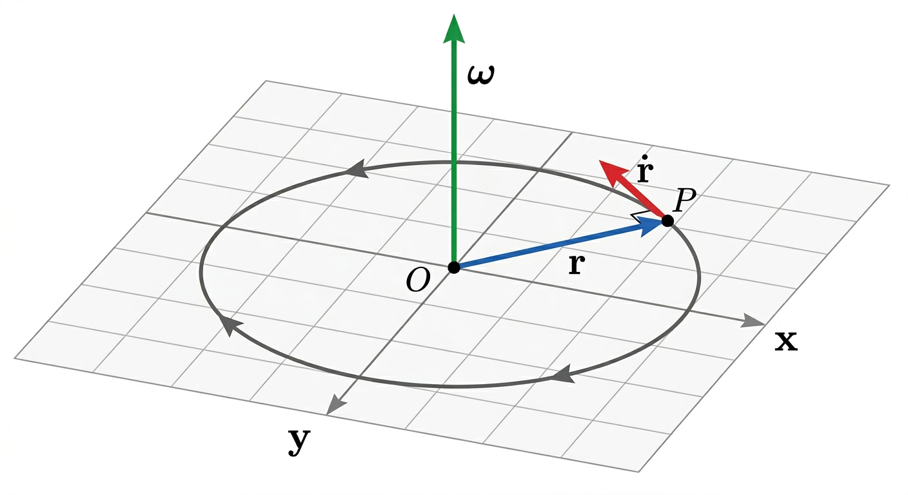

<a href="#top" id="back-to-top" title="Back to Top">Top</a>

# Screw Theory

- Table of Contents
{:toc}

## Prerequisites

- Linear algebra: vectors, matrices, rank, and linear dependence
- Rigid-body kinematics: angular velocity, linear velocity, and reference frames
- Basic statics and mechanics: forces, moments, torques, and power

## General Motivation

Classical robot kinematics usually begins by attaching frames to links and joints, then multiplying the corresponding transformations. This works well for many introductory problems, but it can also make the geometry of motion feel secondary. In a spatial robot, the essential question is not only where each frame is placed, but what motion each joint permits between two neighboring bodies. Screw theory begins precisely from this motion-centered viewpoint. 

The key observation is that rigid-body motion in space has a natural axis-based structure. A finite displacement can be interpreted through a screw: a rotation about an axis combined with a translation along that axis. At the velocity level, the same idea appears as an instantaneous screw axis. Thus, screw theory gives us one geometric language for both displacement and velocity. Rotation, translation, and helical motion are no longer treated as unrelated cases; they become different forms of the same underlying object.

This viewpoint is especially useful in robotics because most elementary joints generate simple screw motions. A revolute joint corresponds to zero pitch, a prismatic joint corresponds to pure translation, and a helical joint corresponds to finite pitch. Therefore, instead of describing every joint through a special frame convention, we can describe it by its screw coordinates. For a joint axis with unit direction $\mathbf e$, a point $\mathbf p$ on the axis, and pitch $h$, the corresponding screw coordinate vector is written as

$$
X =
\begin{bmatrix}
e \\
p \times e + eh
\end{bmatrix}.
$$

The motion generated by this joint is then obtained through the exponential map which is the bridge from instantaneous motion to finite rigid-body motion. In other words, screw theory explains the geometry of the motion, while the exponential map provides the analytic mechanism that turns a joint coordinate into a rigid transformation.

The advantage becomes clearer for serial robots. A 3R robot is not merely a chain of three frame transformations; it is a system generated by three joint screws. Its reachable positions, velocity directions, and singular configurations are shaped by the geometry of these three axes. Likewise, a 6R robot can be viewed as six screw generators acting in sequence. The end-effector motion is then written as a product of exponentials,

$$
H_i(q)
=
\exp(Y_1q_1)\exp(Y_2q_2)\cdots\exp(Y_iq_i)A_i,
$$

where $Y_j$ is the screw coordinate vector of joint $j$ expressed in the inertial frame $F_0$ at the reference configuration, and $A_i=H_i(0)$ is the absolute reference configuration of body $i$.

This formula is not only compact; it changes how we think about forward kinematics. The robot is described by its joint axes and reference pose, rather than by a long sequence of auxiliary frames. This reduces the dependence on restrictive conventions such as Denavit-Hartenberg parameters and makes the geometry of the mechanism more explicit.

Screw theory also prepares the ground for velocity kinematics. The same screw coordinates that generate finite motions become the building blocks of twists and Jacobians. Each column of the geometric Jacobian can be interpreted as a joint screw transported to the current configuration. Singularities can then be studied as situations where the available joint screws lose rank or develop special geometric dependencies. This is why screw theory is more than a notation: it is a way to read the motion capability of a robot directly from the geometry of its axes.

For this chapter, the story is therefore simple. We start from the limitations of purely frame-based kinematics, introduce screws as the natural geometry of rigid-body motion, connect instantaneous and finite motion through the exponential map, and then use the Product of Exponentials formula to describe 3R and 6R robots. Once this language is established, twists, Jacobians, and singularities will appear as different views of the same geometric structure.

> **Exercise 5.1.2**
>
> Consider three one-degree-of-freedom joints: revolute, prismatic, and helical. For each joint, identify the screw axis direction $e$, the pitch $h$, and the physical meaning of the exponential motion $\exp(\widehat{X}q)$. Then explain why a 6R robot can be interpreted as six screw-generated motions composed in sequence.

## Course Content

### Notations

The following notations will be used throughout this chapter. They are fixed here so that the meaning of every symbol stays consistent as the ideas become more advanced.

- A scalar is written in standard italic form, for example $x \in \mathbb{R}$.
- A vector is written in bold lowercase, for example $\mathbf{r}, \mathbf{v}, \mathbf{f}$.
- A matrix is written in bold uppercase, for example $\mathbf{R}, \mathbf{J}, \mathbf{A}$.
- A vector quantity that is traditionally denoted by a Greek letter is written in bold Greek, for example the angular velocity $\boldsymbol{\omega}$.
- Every six-dimensional entity made of two three-dimensional vectors is written as a stacked column vector.

In addition, we will use the following symbols systematically:

- $\mathcal{S}$: a screw
- $\mathcal{T}$: a twist, that is, a motion screw
- $\mathcal{W}$: a wrench, that is, a force screw
- $\mathbf{x}$: the upper three-dimensional part of a generic screw
- $\mathbf{y}$: the lower three-dimensional part of a generic screw
- $\mathbf{f}$: a force vector
- $\mathbf{m}$: a moment vector
- $\mathbf{v}$: a linear velocity vector
- $\boldsymbol{\omega}$: an angular velocity vector
- $\mathbf{s}$: a unit direction vector along a screw axis
- $\mathbf{r}_{OP}$: the position vector from point $O$ to point $P$
- $\mathrm{span}\{\mathcal{S}_1,\dots,\mathcal{S}_k\}$: the subspace generated by the listed screws

Accordingly, a screw is written as a stacked six-dimensional entity:

$$
\mathcal{S}=
\begin{bmatrix}
\mathbf{x} \\  
\mathbf{y}
\end{bmatrix}
$$

When the screw represents motion, we write the twist as:

$$
\mathcal{T}=
\begin{bmatrix}
\boldsymbol{\omega} \\  
\mathbf{v}
\end{bmatrix}
$$

When it represents force transmission, we write the wrench as:

$$
\mathcal{W}=
\begin{bmatrix}
\mathbf{f} \\  
\mathbf{m}
\end{bmatrix}
$$

This stacked notation will be maintained throughout the chapter whenever a six-dimensional object is composed of two three-dimensional vectors.

To discuss reciprocity, we will use $\odot$ to denote the reciprocal product between two screws:

$$
\mathcal{S}_1 \odot \mathcal{S}_2
=
\mathbf{x}_1 \cdot \mathbf{y}_2 + \mathbf{x}_2 \cdot \mathbf{y}_1
$$

In particular, for a wrench and a twist, the pairing becomes:

$$
\mathcal{W} \odot \mathcal{T}
=
\mathbf{f}\cdot\mathbf{v} + \mathbf{m}\cdot\boldsymbol{\omega}.
$$
This scalar is the quantity that will later encode power and reciprocity. A recurring idea in this chapter is that two screws are reciprocal when their pairing is zero.

### Rotation, Exponentials, and Product of Exponentials

To make screw theory useful for robot kinematics, we need one more bridge: how an **instantaneous motion** gives rise to a **finite motion**. That bridge is provided by a differential equation and its solution through the matrix exponential.

#### Rotation as the solution of a differential equation

Before talking about screws in full generality, it helps to start with ordinary rotation.

The set $SO(3)$ is the set of all $3\times 3$ rotation matrices:

$$
SO(3) = \{ \mathbf{R} \in \mathbb{R}^{3 \times 3} \mid \mathbf{R}^T \mathbf{R} = \mathbf{I},\ \det(\mathbf{R}) = 1 \}.
$$

This notation means:

- $S$ stands for **special**, which here means determinant $+1$,
- $O$ stands for **orthogonal**, which means $\mathbf{R}^T\mathbf{R}=\mathbf{I}$,
- $(3)$ means we are in three-dimensional space.

So an element of $SO(3)$ is exactly a matrix that rotates vectors in 3D without stretching them, shrinking them, or reflecting them.

If a rigid body rotates, its orientation changes with time, so we write

$$
\mathbf{R}(t)\in SO(3).
$$

The main question is then:

> If we know the body's instantaneous angular velocity, how do we recover the finite rotation after some time?

That is where the differential equation appears.

#### Simple intuition: one point moving on a circle

First consider a point rotating in the $x$-$y$ plane around the origin with constant angular speed $\omega$. Its position is

$$
\mathbf{r}(t) = 
\begin{bmatrix}
x(t) \\   
y(t)
\end{bmatrix}
$$

From elementary kinematics, the velocity is tangent to the circle and perpendicular to the radius. In matrix form,

$$
\dot{\mathbf{r}}(t)=
\begin{bmatrix}
0 & -\omega \\  
\omega & 0
\end{bmatrix}
\mathbf{r}(t)
$$

<figure>
  
  <figcaption><strong>Figure:</strong> The linear velocity at a point is normal to axis of rotation and its position vector, and is obtained by scaling by the angular speed.</figcaption>
</figure>

So even in this simple planar case, the motion is already written as a linear differential equation of the form

$$
\dot{\mathbf{r}} = \mathbf{A}\mathbf{r},
$$

where the matrix $\mathbf{A}$ encodes the instantaneous generator of rotation.

The 3D case is the same idea, only now the generator is built from the angular velocity vector.

#### How the rotational differential equation appears

Using the skew-symmetric matrix associated with $\boldsymbol{\omega}$,

$$
[\boldsymbol{\omega}] =
\begin{bmatrix}
0 & -\omega_z & \omega_y \\  
\omega_z & 0 & -\omega_x \\  
-\omega_y & \omega_x & 0
\end{bmatrix},
$$

which is defined so that

$$
[\boldsymbol{\omega}]\,\mathbf{a}=\boldsymbol{\omega}\times \mathbf{a}
$$

for every vector $\mathbf{a}\in\mathbb{R}^3$.

Now take any vector $\mathbf{u}$ fixed in the body. As the body rotates, its coordinates in the spatial frame are

$$
\mathbf{r}(t)=\mathbf{R}(t)\mathbf{u}.
$$

Its velocity must be

$$
\dot{\mathbf{r}}(t)=\boldsymbol{\omega}\times \mathbf{r}(t)
=
[\boldsymbol{\omega}]\,\mathbf{r}(t).
$$

But since $\mathbf{u}$ is constant in the body,

$$
\dot{\mathbf{r}}(t)=\dot{\mathbf{R}}(t)\mathbf{u}.
$$

Combining the two expressions gives

$$
\dot{\mathbf{R}}(t)\mathbf{u}
=
[\boldsymbol{\omega}]\,\mathbf{R}(t)\mathbf{u}
$$

for every body-fixed vector $\mathbf{u}$. Therefore,

$$
\dot{\mathbf{R}}(t) = [\boldsymbol{\omega}]\,\mathbf{R}(t),
$$

when $\boldsymbol{\omega}$ is expressed in the spatial frame. This is the rotational differential equation. It says that the rate of change of orientation is produced by the infinitesimal rotation operator $[\boldsymbol{\omega}]$ acting on the current orientation.

If the angular velocity is constant, this linear differential equation has the solution

$$
\mathbf{R}(t)=\exp([\boldsymbol{\omega}]\,t)\,\mathbf{R}(0).
$$

This is the first important idea: a **finite rotation** is obtained by integrating an **instantaneous rotational generator**, and the result is written with the matrix exponential.

#### The matrix exponential

For any square matrix $\mathbf{A}$, the exponential is defined by the power series

$$
\exp(\mathbf{A})=
\mathbf{I}+\mathbf{A}+\frac{\mathbf{A}^2}{2!}+\frac{\mathbf{A}^3}{3!}+\frac{\mathbf{A}^4}{4!}+\cdots
$$

So here we set

$$
\mathbf{A}=[\boldsymbol{\omega}]\,t.
$$

Then

$$
\exp([\boldsymbol{\omega}]\,t)
=
\mathbf{I}
+
[\boldsymbol{\omega}]\,t
+
\frac{([\boldsymbol{\omega}]\,t)^2}{2!}
+
\frac{([\boldsymbol{\omega}]\,t)^3}{3!}
+
\frac{([\boldsymbol{\omega}]\,t)^4}{4!}
+\cdots
$$

To simplify this expression, write

$$
\boldsymbol{\omega} = \theta \mathbf{n}/t, \quad \theta = \| \boldsymbol{\omega} \| t, \quad \| \mathbf{n} \| = 1.
$$

Then

$$
[\boldsymbol{\omega}]\,t=\theta[\mathbf{n}].
$$

So the exponential becomes

$$
\exp([\boldsymbol{\omega}]\,t)=\exp(\theta[\mathbf{n}]).
$$

Now use the identities for a unit vector $\mathbf{n}$:

$$
[\mathbf{n}]^2 = \mathbf{n}\mathbf{n}^T - \mathbf{I}, \quad [\mathbf{n}]^3 = -[\mathbf{n}], \quad [\mathbf{n}]^4 = -[\mathbf{n}]^2.
$$

Hence the powers repeat in cycles:

$$
[\mathbf{n}]^{2k+1} = (-1)^k[\mathbf{n}], \quad [\mathbf{n}]^{2k+2} = (-1)^k[\mathbf{n}]^2.
$$

Substituting into the power series gives

$$
\exp(\theta[\mathbf{n}])
=
\mathbf{I}
+
\left(\theta-\frac{\theta^3}{3!}+\frac{\theta^5}{5!}-\cdots\right)[\mathbf{n}]
+
\left(\frac{\theta^2}{2!}-\frac{\theta^4}{4!}+\frac{\theta^6}{6!}-\cdots\right)[\mathbf{n}]^2.
$$

Recognizing the sine and cosine series,

$$
\sin\theta = \theta-\frac{\theta^3}{3!}+\frac{\theta^5}{5!}-\cdots, \quad
1-\cos\theta = \frac{\theta^2}{2!}-\frac{\theta^4}{4!}+\frac{\theta^6}{6!}-\cdots
$$

we obtain the Euler-Rodrigues formula:

$$
\exp(\theta[\mathbf{n}])
=
\mathbf{I}
+
\sin\theta\,[\mathbf{n}]
+
(1-\cos\theta)\,[\mathbf{n}]^2.
$$

Returning to $\boldsymbol{\omega}$ gives the equivalent form

$$
\exp([\boldsymbol{\omega}]\,t)
=
\mathbf{I}
+
\frac{\sin \theta}{\theta}[\boldsymbol{\omega}]\,t
+
\frac{1-\cos \theta}{\theta^2}([\boldsymbol{\omega}]\,t)^2,
\quad
\theta = \|\boldsymbol{\omega}\|t.
$$

So the exponential is not an abstract symbol only. It is the compact closed-form expression for the finite rotation generated by a constant angular velocity.

<figure>
  

    Placeholder image: angular velocity vector generating an infinitesimal rotation and the corresponding finite rotation.
  

  <figcaption><strong>Figure:</strong> Angular velocity acts as the generator of rotation. Integrating the rotation differential equation produces a finite rotation matrix through the exponential map.</figcaption>
</figure>

#### From rotations to rigid motions

Rigid-body motion in space involves both orientation and position. We therefore move from the rotation group $SO(3)$ to the rigid-motion group $SE(3)$.

A rigid motion is written as a homogeneous transformation

$$
\mathbf{T}(t)=
\begin{bmatrix}
\mathbf{R}(t) & \mathbf{p}(t) \\  
\mathbf{0}^T & 1
\end{bmatrix} \in SE(3)
$$

Its instantaneous motion is described by a twist

$$
\mathcal{T}=
\begin{bmatrix}
\boldsymbol{\omega} \\  
\mathbf{v}
\end{bmatrix},
$$

or equivalently by the matrix form

$$
[\mathcal{T}] =
\begin{bmatrix}
[\boldsymbol{\omega}] & \mathbf{v} \\  
\mathbf{0}^T & 0
\end{bmatrix}
$$

The rigid motion then satisfies the analogous differential equation

$$
\dot{\mathbf{T}}(t) = [\mathcal{T}]\,\mathbf{T}(t).
$$

If the twist is constant, the solution is

$$
\mathbf{T}(t)=\exp([\mathcal{T}]\,t)\,\mathbf{T}(0).
$$

This is the finite version of a twist. In other words, a constant twist generates a finite **screw motion**. Rotation appears as a special case; pure translation appears as another limiting case; and the general case combines both in one unified object.

<figure>
  

    Placeholder image: a screw axis in space with simultaneous rotation about the axis and translation along it.
  

  <figcaption><strong>Figure:</strong> A constant twist generates a screw motion: the body rotates about an axis while translating along the same axis according to the pitch.</figcaption>
</figure>

#### Product of exponentials

Once a single joint motion is written as an exponential, a serial chain can be built by composing those exponentials one after another.

Suppose joint $i$ is associated with a screw axis $\mathcal{S}_i$, expressed in a chosen reference configuration. If its joint variable is $q_i$, then the motion contributed by that joint is written as

$$
\exp([\mathcal{S}_i]\,q_i).
$$

For a serial manipulator with $n$ joints, the end-effector configuration can therefore be written as

$$
\mathbf{T}(q)
=
\exp([\mathcal{S}_1]q_1)
\exp([\mathcal{S}_2]q_2)
\cdots
\exp([\mathcal{S}_n]q_n)\,
\mathbf{M},
$$

where $\mathbf{M}$ is the end-effector pose in the reference configuration.

This expression is called the **Product of Exponentials (POE)** formula. Each factor represents one joint screw acting on the body, and the complete forward kinematics is obtained by multiplying these finite joint motions in sequence.

The conceptual advantage is important:

- the model is written directly in terms of geometric joint axes,
- revolute, prismatic, and helical joints are treated in one common language,
- the kinematics is expressed without needing restrictive coordinate conventions such as Denavit-Hartenberg tables.

<figure>
  

    Placeholder image: a serial manipulator with joint screw axes and the successive exponentials composing the end-effector pose.
  

  <figcaption><strong>Figure:</strong> In a serial chain, each joint contributes one exponential map. Their ordered product gives the full end-effector configuration.</figcaption>
</figure>

#### Why this matters for screw theory

This viewpoint gives screw theory a direct kinematic meaning. A screw is no longer only a six-dimensional stacked quantity: it becomes the generator of a finite rigid-body motion. The exponential map tells us how to pass from an instantaneous twist to an actual displacement, and the POE formula shows how several joint screws combine to produce the motion of an entire robot. This will be essential later when we express joint motions, derive Jacobian columns from joint screws, and interpret singularities as geometric changes in the screw systems that the robot can generate or resist.

### Temporary

#### How to use

- Drag the circular handle at the end of the line to rotate the screw direction.
- Drag the line itself to translate it along its normal direction.
- Use the sliders if you want finer control over the rotation and translation.

This interactive sketch works in the $x$-$y$ plane. The line represents the screw axis, $\mathbf{s}$ is the unit direction of the line, and $\overline{OA}$ is the perpendicular from the origin $O$ to the line. The moment is updated from the current geometry using the moment-generation rule
$$
\mathbf{m}_O = \mathbf{r}_{OA} \times \mathbf{s}.
$$
As you move the line, the current screw updates live.

  

    

      <svg id="temporary-screw-svg" viewBox="0 0 520 520" aria-label="Interactive screw sketch in the x-y plane">
        <rect x="0" y="0" width="520" height="520" fill="#fff"></rect>
        <g id="temporary-screw-scene"></g>
      </svg>
    

    

      

        <label for="temporary-screw-angle">Rotation of the line</label>
        <input id="temporary-screw-angle" type="range" min="-180" max="180" value="30" step="1">
      

      

        <label for="temporary-screw-offset">Signed distance from the origin</label>
        <input id="temporary-screw-offset" type="range" min="-140" max="140" value="70" step="1">
      

      

        The line is parameterized by a direction vector $\mathbf{s}$ and a perpendicular offset from the origin. The point $A$ is the foot of the perpendicular from $O$ onto the line.
      

      

    

  

## Credits

This course page was created by Durgesh Haribhau Salunkhe and Prof. Andreas Müller, with Prof. Aude Billard and funded by IEEE RAS and EPFL.

## Resources

1. A. Muller and D. Zlatanov (eds.), *Singular Configurations of Mechanisms and Manipulators*.
2. D. S. Zlatanov, *Generalized Singularity Analysis of Mechanisms*, Ph.D. dissertation, University of Toronto, 1998.
3. M. Conconi and M. Carricato, "A New Assessment of Singularities of Parallel Kinematic Chains," *IEEE Transactions on Robotics*, vol. 25, no. 4, pp. 757-770, 2009.
4. J. Selig, *Geometric Fundamentals of Robotics*.
5. R. Murray, Z. Li, and S. Sastry, *A Mathematical Introduction to Robotic Manipulation*, CRC.

